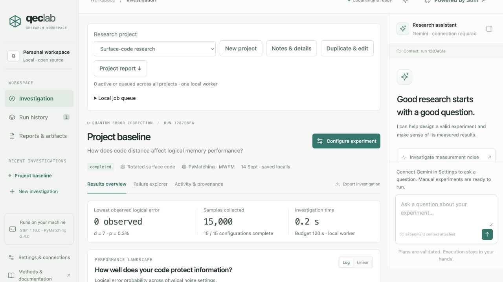
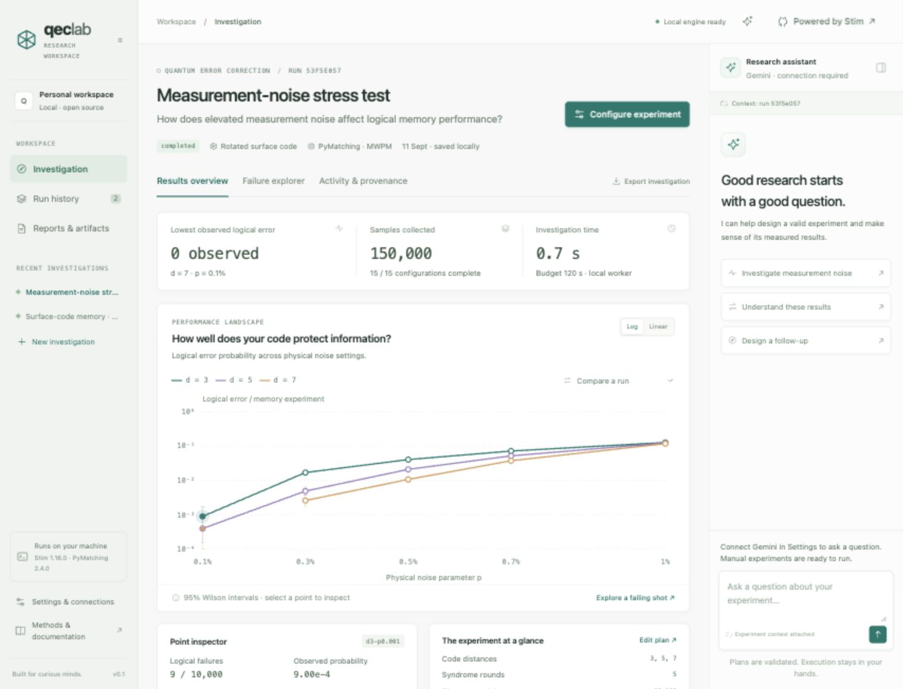
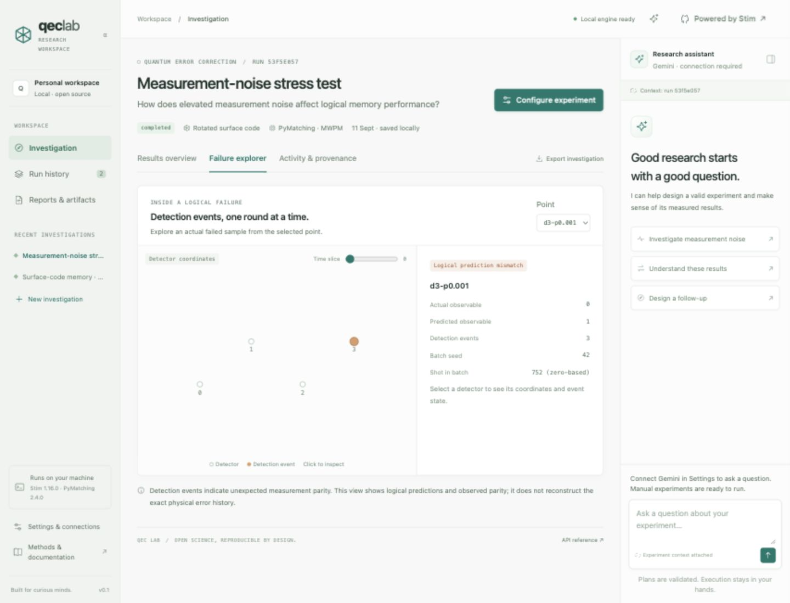

# QEC Lab

An open source, local-first research workspace for quantum error correction. Ask a question, review a plan, run a real surface-code simulation, inspect the evidence, and export a reproducible investigation.

**Status: working single-workspace alpha.** The scientific engine and manual workflow work without an AI key. Gemini enables tool-assisted planning and analysis. This is not yet a hosted multi-tenant SaaS.

The **v0.2 development milestone** adds named research projects, project notes, separate drafts and draft conversations, a shared job queue with cancellation controls, duplicate-and-edit plans, and combined Markdown project reports. Existing investigations appear under **My research**. Projects organize one trusted local workspace; they are not account or security boundaries.

### Project workflow

1. Choose **New project**, give it a name, and record your research question in its notes.
2. Configure and run an investigation. History, recent runs, comparisons, and reports use the selected project.
3. Use **Duplicate & edit** to review a follow-up plan. Saving a draft or opening a copy does not execute it.
4. Inspect **Local job queue** to view and cancel pending work across projects.
5. Use **Notes & details** to record observations and **Project report** to download notes and scientific summaries together. Individual reproduction bundles remain available separately.

Remaining v0.2 work includes in-app model selection and connection testing, richer report figures, guided onboarding, and broader agent evaluation. This milestone is not the final v0.2 release.

## Platform preview

Real results from a measurement-noise stress investigation: 150,000 sampled memory experiments across 15 configurations. The optional assistant is shown disconnected; these measurements were produced by the scientific engine.

Inspect a captured logical failure through detector events, syndrome time slices, and actual versus predicted observable parity.

Explore the [portfolio case study and demo walkthrough](docs/PORTFOLIO.md).

## Start the application

Requires Python 3.12. Node is only needed for the optional JavaScript syntax check.

    python3 -m venv .venv
    source .venv/bin/activate
    pip install -r requirements.lock
    uvicorn qec.server:app --host 127.0.0.1 --port 4173

Open [QEC Lab](http://127.0.0.1:4173). Use **Configure experiment → Baseline sweep → Run investigation** to collect your first results. An empty installation contains no fabricated benchmark data.

To use Gemini, enter your key in **Settings & connections**. The key stays in server memory until restart. Alternatively, supply environment variables before starting the server:

    export GEMINI_API_KEY="your-key"
    export GEMINI_MODEL="gemini-3.8-flash"

Use a model available to your account that supports the Gemini GenerateContent function-calling API. No .env file is loaded automatically. .env.example documents the variables; do not commit secrets.

Questions, plans, recent conversation history, and selected result summaries are sent to Google when you use the assistant. Raw detector arrays are excluded from the evidence tool. The UI reports provider errors without pretending to have run an AI investigation.

## What works

- A responsive, light scientific workspace with editable plans and a contextual assistant.
- Real Stim rotated surface-code Z-memory experiments for distances 3, 5, 7, and 9.
- Circuit-level Pauli noise sweeps with an independent measurement-noise multiplier.
- PyMatching MWPM with matched weights or intentionally mismatched measurement-noise assumptions.
- A bounded local job queue, batch progress, cooperative cancellation, and saved partial results.
- Selectable charts with log/linear scales, pointwise Wilson intervals, distance toggles, and comparison overlays.
- Actual failed-shot inspection by detector coordinate and syndrome time slice.
- Persistent SQLite run history, a saved draft, conversation history, and execution provenance.
- Markdown reports, CSV, exact circuits, decoder models, batch seeds, dependency versions, and standalone replay bundles.
- A Python CLI, HTTP API, and optional browser WebMCP read/staging tools.
- A bounded Gemini tool loop: read evidence → validate a proposed experiment → explain the result. A proposed plan requires the user to press **Run investigation**.

Gemini's protocol and tool boundaries are tested with mocked responses. A live `gemini-3.8-flash` smoke test also verified plan staging and analysis of real simulation evidence; see the [live validation record](docs/LIVE_VALIDATION.md). This is a small functional check, not a broad evaluation of scientific reliability. Live use requires your own key. Temporary HTTP 502/503/504 failures are retried up to three attempts with bounded backoff.

## A first investigation

1. Run the **Baseline sweep** preset.
2. Run **Measurement stress**, which changes measurement flips from p to 3p while retaining a matched decoder.
3. Select the baseline in **Compare a run**. Inspect the differences listed above the plot.
4. Select a chart point, then **Explore a failing shot**.
5. Run **Decoder mismatch** to keep the stressed circuit but use decoder weights assuming measurement noise p.
6. Export each investigation. Compare counts and uncertainty; do not infer a threshold from a few finite distances.

A successful run is not a claim of a statistically significant difference. Identical seeds across related runs can create correlated samples; independent error-bar overlap is not a paired significance test.

## Scientific contract

The generated circuit is surface_code:rotated_memory_z. Its noise parameters are:

| Channel | Simulation probability |
|---|---|
| Depolarization after Clifford gates | p |
| Data depolarization before each syndrome round | p |
| Reset flips | p |
| Measurement flips | measurement_multiplier × p |

For **matched** decoding, the detector error model uses those same parameters. For **mismatched** decoding, the decoder assumes measurement flips p, while the sampling circuit remains unchanged.

Logical error rate means **logical observable prediction failures / sampled memory experiments**. It is not normalized per syndrome round. The x-axis p is a channel parameter, not an aggregate hardware error rate. Matching uses the decomposed graphlike detector error model; “matched” does not mean optimal decoding of every circuit correlation.

Intervals are two-sided nominal **95% Wilson binomial intervals**. Each point has a fixed sample target. Live, cancelled, or budget-truncated points are explicitly provisional; no sequential or simultaneous coverage is claimed. Zero observed failures has a nonzero upper limit. No automatic threshold fitting is implemented.

The failure explorer displays detection events, detector coordinates, and actual/predicted logical observable parity. It does not reconstruct an exact injected physical error history or a matching correction path.

Timing records batch decoder calls only. It excludes sampling and graph construction and is not real-time hardware latency. The wall-time limit is checked between bounded batches and points, so one compilation or batch can finish after the limit.

## Reproduction

Unzip a reproduction bundle into a new directory:

    python3 -m venv .venv
    source .venv/bin/activate
    pip install -r requirements.txt
    python replay.py

The script replays every recorded batch and checks that failure counts agree with saved results. Exact Stim samples depend on library version, sampling-call shape, and CPU SIMD architecture; seeds alone do not promise bit-for-bit portability.

The export is a snapshot, including partial results at download time. The assistant.json file preserves the conversation separately from the deterministic scientific report.

## CLI and API

    python -m qec.cli examples/baseline.json --output data/baseline-cli.json

The CLI uses the same validated scientific engine as the web application. CLI output is a standalone result file; it does not insert a row into web run history.

See the local [API reference](http://127.0.0.1:4173/docs) and [OpenAPI schema](http://127.0.0.1:4173/openapi.json). Main endpoints:

| Endpoint | Purpose |
|---|---|
| POST /api/runs | Validate and queue an experiment specification |
| GET /api/runs | List investigations |
| GET /api/runs/{id} | Read measurements, progress, and provenance |
| POST /api/runs/{id}/cancel | Request cooperative cancellation |
| GET /api/runs/{id}/export | Download a reproduction ZIP |
| GET /api/runs/{id}/report | Download a Markdown report |
| GET/POST /api/draft | Read or save the workspace draft |
| POST /api/assistant | Ask Gemini with experiment context |
| GET /api/messages?scope={run_id} | Read a persisted conversation |
| POST /api/settings | Set or clear the in-memory Gemini key |

## Architecture

    Browser workspace ── HTTP ── FastAPI
                                  ├── Gemini tool loop
                                  │     ├── read selected evidence
                                  │     └── validate/stage a plan
                                  ├── one local worker
                                  │     └── Stim → samples → PyMatching → statistics
                                  └── SQLite
                                        ├── specifications and measured artifacts
                                        ├── execution provenance
                                        └── drafts and assistant conversations

- qec/engine.py: validated plans, circuits, sampling, intervals, scientific reports.
- qec/agent.py: Gemini integration and bounded, typed tool dispatch.
- qec/server.py: API, queue, persistence, exports, and static assets.
- qec/replay.py: independent artifact replay.
- app.js, index.html, styles.css: browser workspace with no frontend build dependency.
- tests/: scientific invariants, exact replay, API boundaries, and agent contract tests.

## Validation

    python -m pytest -q
    node --check app.js

Tests cover noiseless behavior, fixed-seed consistency, replay of a captured failure, decoder-model mismatch, invalid plans, cancellation, time budgets, Wilson reference values, API/export replay, persistent drafts, restart recovery, and mocked Gemini tool calls.

Browser QA includes creating actual runs, linked point inspection, the failure explorer, comparison controls, mobile overflow, and browser tool staging.

## Local deployment boundary

The default server binds only to 127.0.0.1. It is designed for one trusted user/workspace. All local clients share access to runs and the configured key. Trusted-host and same-origin write checks provide basic browser isolation; they do not replace authentication.

Do not expose this server directly to a public network. Before hosted SaaS use, implement authentication, tenant isolation, user-owned credentials, quotas, durable distributed workers, migrations, backups, and an operational security review.

Docker packaging is provided for local use:

    docker compose up --build

Docker is optional; the validated development path is the Python environment above. SQLite data persists in the named Docker volume or, locally, in data/. Set QEC_DATA_DIR to choose another data directory.

## Roadmap

Next milestones: evidence-grounded agent evaluations with live providers, statistically justified adaptive sampling, richer failure-path visualization, and isolated team workspaces. Hardware integrations and additional code families follow scientific validation of each adapter.

## Portfolio notes

The [portfolio case study](docs/PORTFOLIO.md) explains the product problem, the five-minute demo flow, the engineering highlights, and the current scope boundary.

## Contributing and license

See [CONTRIBUTING.md](CONTRIBUTING.md). Project code is MIT licensed; scientific dependencies retain their respective licenses. Please cite the scientific tools when publishing results:

- [Stim](https://github.com/quantumlib/Stim)
- [PyMatching](https://github.com/oscarhiggott/PyMatching)
- [Gemini function calling](https://ai.google.dev/gemini-api/docs/function-calling)
